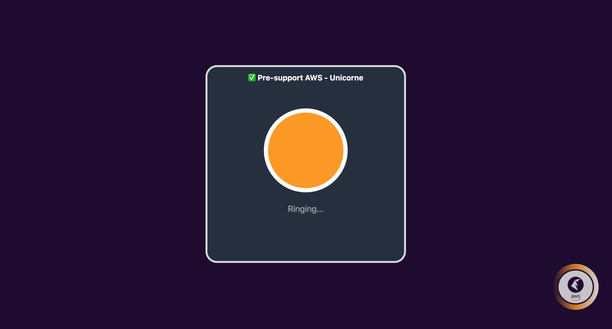
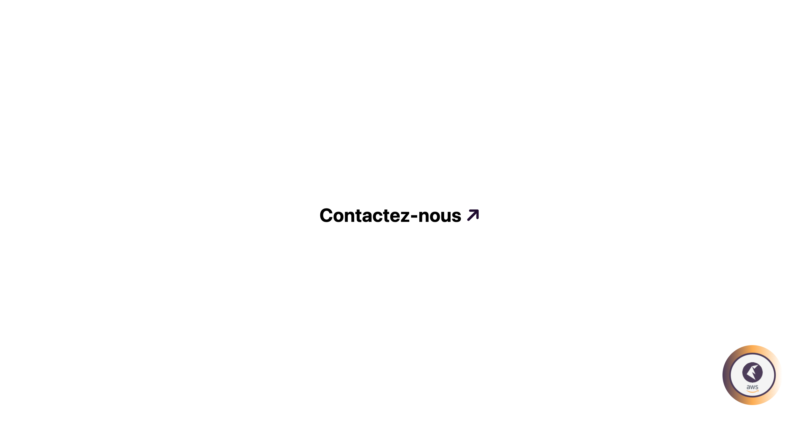

# Real-Time Voice Chat Application with an LLM acting as AWS Associate Solution Architect (Pre-support)

This repository contains the code for a pre-consultation on AWS services that enables users to have a conversational exchange with an AI using their voice. The application captures audio from the user's microphone, processes it in real time, and delivers the AI's audio response back to the user. Each conversation is managed as a separate session to ensure privacy and coherence.

## Features

- Finetuned LLM model (RAG approach) to provide aAWS Solution Associate based knownedge and act as a Unicorne.cloud agent, check the Website at Service conseil
infonuagique, Step 1. Évaluation, Partenaire AWS
- Real-time audio capture and streaming.
- Bidirectional communication using WebSockets.
- Speech-to-text conversion using Amazon Transcribe.
- AI response generation using Amazon Bedrock (LLM).
- Text-to-speech conversion using Amazon Polly.
- Session-based interaction with unique IDs for users.
- Automatic PDF transcript generation and storage in Amazon S3.
- Allowing user to continue the conversation with an expert passing the gathered PDF pre-evaluation
- Frontend built with React and TypeScript, styled with Tailwind CSS and Shadcn UI.

## Frontend (ui)

The frontend is a single-module application built with React and TypeScript. It uses Tailwind CSS for styling and some Shadcn UI components for accessibility.
It's meant to be integrated as a floating widget that can be popup on top of the company's page

### Setup

1. Install Node.js and npm.
2. Clone the repository and navigate to the `ui` directory.
3. Run `npm install` to install dependencies.
4. Start the development server with `npm start`.

### Usage

- Users can start the voice chat by clicking the "Play" button.
- The "Stop" button can be used to end the audio capture.
- The "End Session" button will terminate the session and trigger the PDF generation.

## Backend

The backend is a serverless application deployed using AWS Chalice. It handles WebSocket connections, audio processing, and AI interactions.

### Setup

1. Install AWS CLI and configure it with your AWS credentials.
2. Install Chalice using `pip install chalice`.
3. Navigate to the `api` directory and deploy the application with `chalice deploy`.

### Services

- AWS Lambda functions for processing and AI interaction.
- Amazon Transcribe for speech-to-text conversion.
- Amazon Bedrock (LLM) for AI response generation.
- Amazon Polly for text-to-speech conversion.
- Amazon ElastiCache for session context management.
- Amazon S3 for storing PDF transcripts.

## Session Management

- Sessions are limited to 15 message exchanges or can be manually ended by the user.
- A PDF transcript is generated after each AI response or when the session ends.
- The transcript is uploaded to Amazon S3, and the session data is cleared.

## Monitoring and Cost Management

- AWS Budgets and AWS Cost Explorer are used for cost tracking and management.
- AWS CloudWatch is set up for monitoring and alerts.
- AWS Trusted Advisor provides recommendations for optimization.

## Contributing

Contributions are welcome! Please read the CONTRIBUTING.md for details on our code of conduct and the process for submitting pull requests.

## License

This project is licensed under the MIT License - see the LICENSE.md file for details.

## Acknowledgments

- AWS for providing the services used in this project.
- All contributors who help maintain and improve this application.
